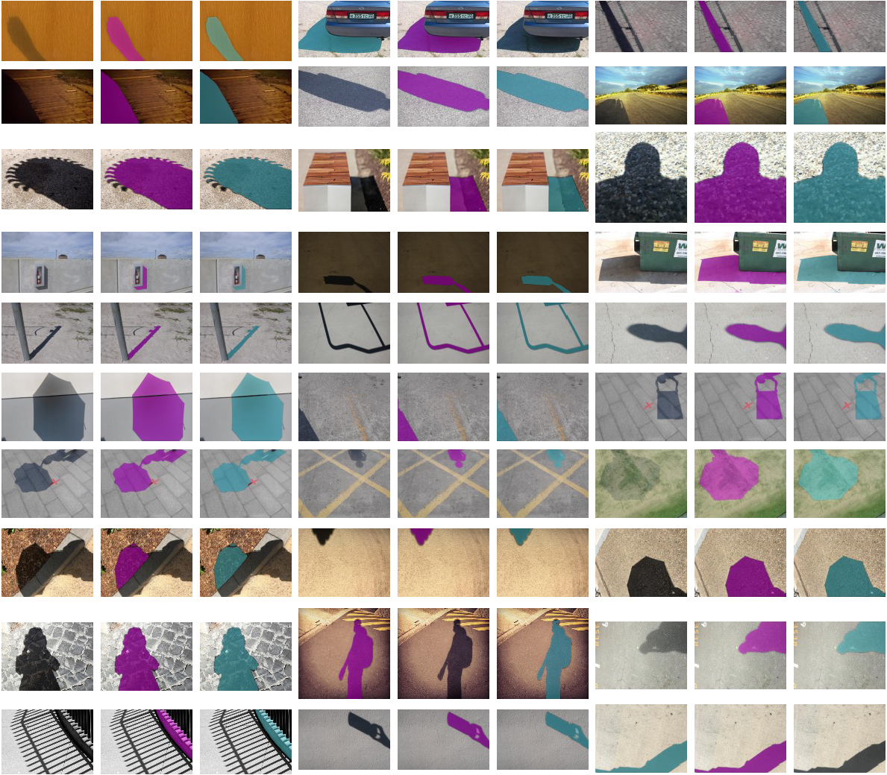

# SAMShadow
Source code for our technical report ["When SAM Meets Shadow Detection"](https://arxiv.org/abs/2305.11513). In this report, we evaluate the performance of [SAM](https://github.com/facebookresearch/segment-anything) on four shadow detection datasets.

***
## Datasets
* SBU [click to download](https://www3.cs.stonybrook.edu/~cvl/projects/shadow_noisy_label/index.html)
* UCF [click to download](https://drive.google.com/file/d/12DOmMVmE-oNuJVXmkBJrkfBvuDd0O70N/view)
* ISTD [click to download](https://github.com/DeepInsight-PCALab/ST-CGAN)
* CUHK (please email [the authors](https://github.com/xw-hu/CUHK-Shadow) to get access) 
  
Note: you need to move all the images in the test split of CUHK into one single folder!!!

## How to use
1. generate multiple predictions for each dataset
```
sh gen_predictions.sh
```
2. eval
```
sh eval.sh
```

## Predicted Masks


All predictions can be downloaded from:
* [OneDrive] (https://lifehkbueduhk-my.sharepoint.com/:u:/g/personal/17482305_life_hkbu_edu_hk/Eblu2TdCD_pNr3ELsZoKAtYBIwyICd5qrYI1-AAjbd_Clg?e=Cjjrpf) (password: tLZf9rF9QLLfy!BM)
* [Baidu](https://pan.baidu.com/s/1w388rERFCEpF6IlcQPfIYA) (password: k7d1)


## Citation
If you find this code useful in your research, please cite
```
@misc{jie2023sam,
    title={When SAM Meets Shadow Detection},
    author={Leiping Jie and Hui Zhang},
    year={2023},
    eprint={2305.11513},
    archivePrefix={arXiv},
    primaryClass={cs.CV}
}
```

## Acknowledgment
We thank SAM (https://github.com/facebookresearch/segment-anything) and SAMCOD (https://github.com/luckybird1994/SAMCOD) for their excellent work.